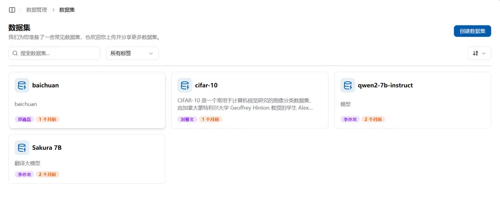
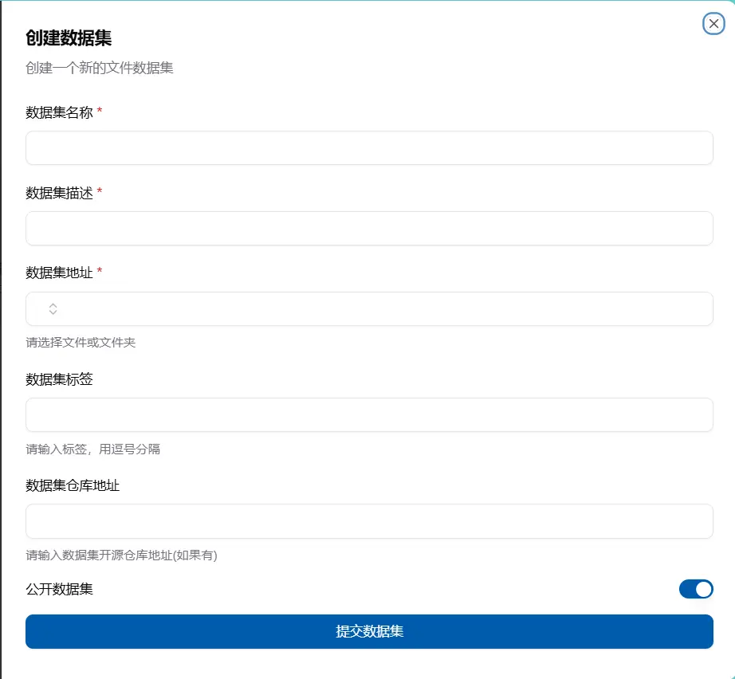
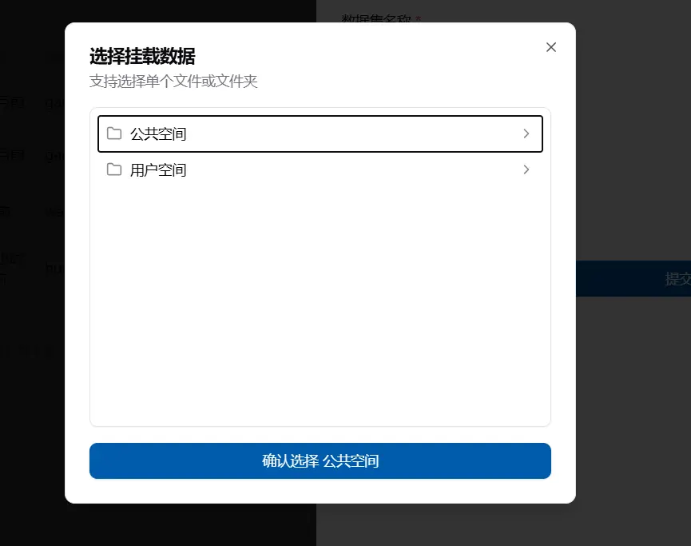
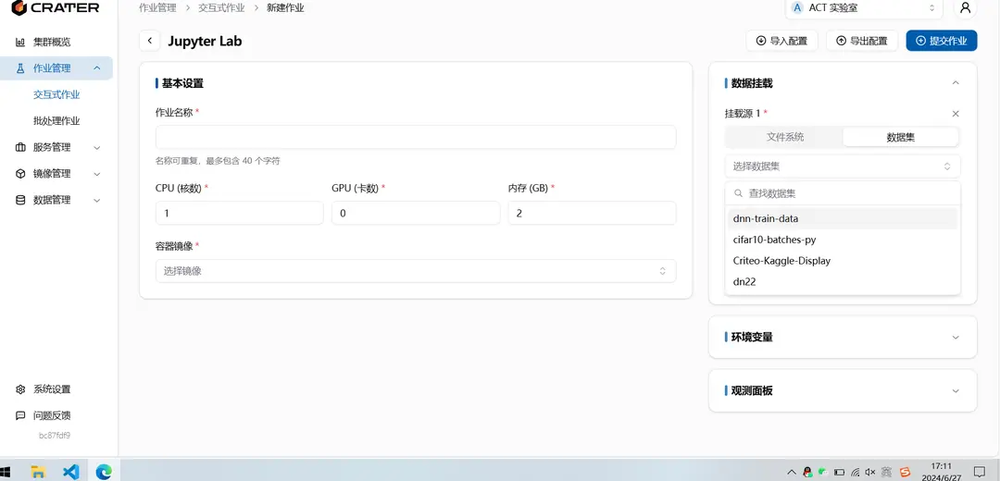

# 数据集

## 数据集是什么

数据集其实是一个链接，将数据集指向一个特定的文件位置，这样可以更方便的进行挂载和分享。目前仓库地址功能还不能实现直接从开源社区下载，主要提供一种特定的描述，方便分享。如果需要从开源社区下载，可参考作业模板中的从魔搭社区下载模型和数据集，或者下载到本地后上传到平台，关于大文件上传可参考文件系统部分

## 数据集/模型与共享文件的区别

数据集/模型主要是提供一种只读的文件，后续我们将提供将数据集/模型移动到只读的共享文件夹中，并通过相应技术对数据集/模型进行加速，从而提高训练效率。共享文件主要提供将个人文件分享给他人，并允许他人读写的功能。如果需要对公共空间中的文件进行读写，可以联系管理员。

## 在哪查看数据集

在`数据管理-数据集`下，可以查看数据集。这里显示的数据集包括用户自己创建的、个人被分享的和账户被分享的数据。

每个数据集会有一些基本描述，在右边有四个按钮，分别是删除，个人分享，账户分享和重命名。这些操作都需要数据集创建者才能使用。

## 怎么创建数据集

在数据集页面左上角有一个创建数据集按钮，点击后填写名称、描述并选择文件夹位置进行创建。

创建的数据集名称不能相同，选择文件夹时会自动跳出你能看见的公共、个人及当前账户的空间文件，然后进行选择

## 怎么使用数据集

在新建作业的页面，右边有个数据挂载框，添加数据挂载后，可以选择数据集，然后将其挂载到容器内。

