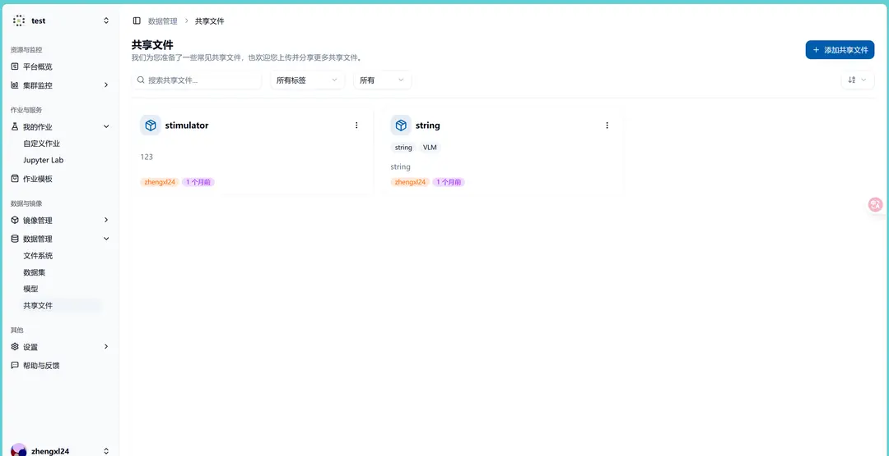
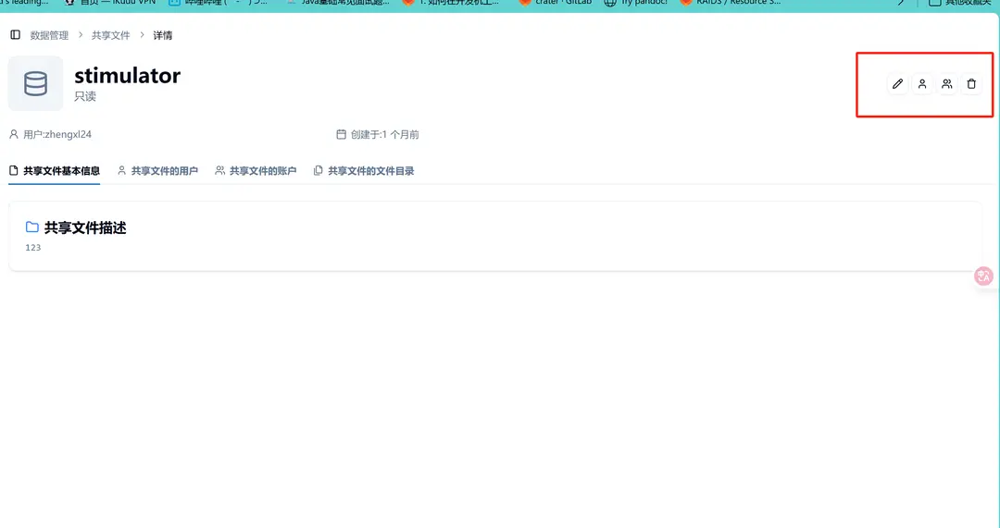
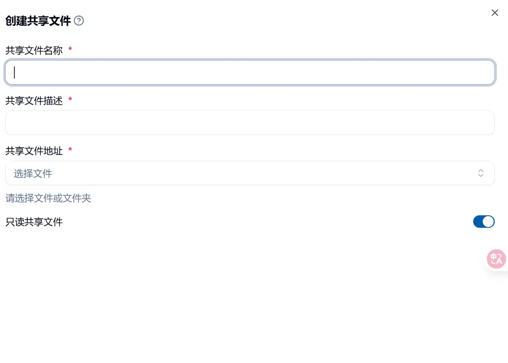

# 共享文件

## 共享文件是什么

共享文件是为了用户将自己可读的文件共享给他人，允许他人读写

## 数据集/模型与共享文件的区别

数据集/模型主要是提供一种只读的文件，后续我们将提供将数据集/模型移动到只读的共享文件夹中，并通过相应技术对数据集/模型进行加速，从而提高训练效率。共享文件主要提供将个人文件分享给他人，并允许他人读写的功能。如果需要对公共空间中的文件进行读写，可以联系管理员。

## 在哪查看共享文件

在`数据管理-共享文件`下，可以查看共享文件。这里显示的数据集包括用户自己创建的、个人被分享的和账户被分享的文件。

每个共享文件会有一些基本描述，在右边有四个按钮，分别是删除，个人分享，账户分享和重命名。这些操作都需要数据集创建者才能使用。

## 怎么创建共享文件

在数据集页面左上角有一个创建共享文件按钮，点击后填写名称、描述并选择文件夹位置进行创建。

创建的共享文件夹名称不能相同，选择文件夹时会自动跳出你能读写的个人及当前账户的空间文件，然后进行选择

## 怎么使用共享文件

在新建作业的页面，右边有个数据挂载框，添加数据挂载后，可以通过检索选择相应的共享文件，然后将其挂载到容器内。

